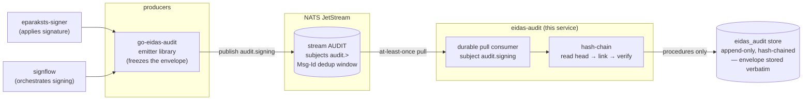
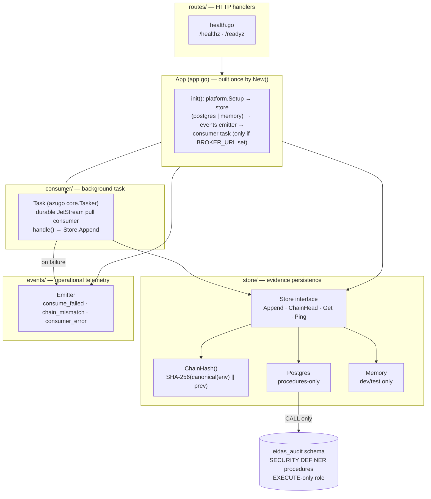

# eidas-audit

The **signing-evidence sink** of the eSignature portal — the append-only, **hash-chained** legal record of *who applied which signature to which document, when, and at what assurance level*. It is the read/verify side of the eIDAS evidence trail: producers freeze a signing event into a broker envelope and publish it; this service verifies the chain and appends it, tamper-evidently, forever.

`eidas-audit` **consumes** events from a message broker (NATS JetStream) and **lands** each one into its own `eidas_audit` store. It does not produce signing events and it does not sign anything — the signing services (`eparaksts-signer`, `signflow`) emit the events through the shared `go-eidas-audit` emitter library; this service is the durable, court-grade destination. For every event it reads the current chain head, computes the next hash link over the canonical envelope bytes, and appends only if the link is continuous — a break is rejected, never absorbed. The chain itself is the tamper-evidence: any after-the-fact edit or deletion breaks every hash downstream of it and is detectable by re-walking the chain (hash chaining / Merkle-style linked integrity; the digest is SHA-256, FIPS 180-4).

The service is **consumer-first**: its real work happens on a background broker task, not on an HTTP handler. The only HTTP surface today is liveness/readiness. The consumer is packaged as a self-contained task so the exact same code either runs standalone (this binary) or is bundled into another service that imports it — no HTTP surface is added on the consume path either way.

This is one of three parallel audit regimes in the portal, kept deliberately separate: eIDAS signing evidence (this service, hash-chained), GDPR access logging (`access-audit`), and operational security telemetry (shipped to a SIEM). By least privilege the eIDAS-audit store never reaches into any other schema.

---

## Where it sits

`eidas-audit` sits at the tail of the signing pipeline. Signing services apply a signature, then emit a frozen event envelope through the `go-eidas-audit` emitter; the broker (NATS JetStream) durably captures it on the `audit.signing` subject; this service is the sole durable consumer of that subject and appends each event to its hash-chained store. The signing services never call this service directly — the broker is the seam, so signing latency is fully decoupled from audit persistence.



Division of labour: the **producers** own *what* an audit event says — they freeze the envelope (actor, resource, event type, outcome, assurance, timestamp) at the signing boundary; the envelope is append-only by contract (new optional fields are allowed, renames never). The **broker** owns durable, at-least-once delivery and server-side de-duplication. `eidas-audit` owns *integrity and permanence* — it verifies chain continuity and appends, and it is the only writer of the `eidas_audit` store. The two meet at the frozen envelope on the `audit.signing` subject.

---

## HTTP surface

`eidas-audit` is **consumer-only**. It exposes no inbound business API — the read/verify/chain-head API (subject retrieval, chain verification for auditors) is deferred and will be added behind service-to-service auth when it lands. The only HTTP endpoints are the platform probes:

| Method + path | Purpose | Notes |
|---|---|---|
| `GET /healthz` | Liveness | Returns `ok` whenever the process is up; request logging suppressed |
| `GET /readyz` | Readiness | Pings the evidence store; `503` + `store unavailable` when the store is unreachable |

Everything the service actually does is driven by the broker consumer, not by a request. The server exists mainly to host the consumer task and answer container health probes.

---

## Architecture

One application container (`App` in `app.go`) is built once by `New()`: it runs the shared platform setup, opens the evidence store (PostgreSQL when a DSN is configured, otherwise an in-memory store for development), constructs the operational-event emitter, and — only when a broker URL is configured — registers the consumer as a background task. Absent a broker, the service still boots and serves health; absent a store DSN, it warns loudly and falls back to memory (which does not survive a restart).



The persistence contract (`store.Store`) is one interface with two backends — Postgres and Memory — that build the *same* hash chain via the shared `ChainHash` helper, so the in-memory backend is a faithful, non-durable stand-in for tests.

---

## Consume → verify → append

For each delivered message the consumer decodes the envelope, hands it to the store, and the store links it into the chain. Delivery is at-least-once: a handler that returns an error naks the message so JetStream redelivers it — an audit event is **never silently dropped** — and event-id idempotency makes redelivery safe.

```mermaid
sequenceDiagram
    participant JS as NATS JetStream
    participant C as consumer.Task
    participant S as store (Append)
    participant P as eidas_audit.append_event
    participant E as events.Emitter

    JS->>C: deliver audit.signing (broker.Envelope)
    C->>S: Append(envelope, sourceService)
    S->>P: BEGIN; lock_chain → chain append lock (held to commit)
    S->>P: chain_head → current head hash
    S->>S: hash = SHA-256(canonical(envelope) || prev_hash)
    S->>P: append_event(envelope, prev_hash, hash); COMMIT
    alt event_id already stored (redelivery)
        P-->>S: duplicate = true (no new row)
        S-->>C: AppendResult{Duplicate:true}
        C-->>JS: ack
    else prev_hash == chain head (continuous)
        P->>P: INSERT row (append-only)
        P-->>S: rowId, hash, duplicate=false
        S-->>C: AppendResult
        C-->>JS: ack
    else prev_hash != chain head (gap / reorder)
        P-->>S: error chain_mismatch
        S-->>C: error
        C->>E: ChainMismatch(event_id)
        C-->>JS: nak → redeliver
    end
```

An append runs *lock → read head → compute → append* as **one database transaction**: `lock_chain` takes the chain's append lock first (the same lock `append_event` takes, re-entrant within the transaction, released at commit), so appenders on different replicas queue on the chain instead of racing it — the head a replica reads is the head it appends to. The database still enforces the linkage independently, so a `chain_mismatch` now signals a real fault (tampering or a bug), not ordinary concurrency; it is still refused, alarmed and redelivered rather than allowed to corrupt the chain. An in-process mutex additionally keeps a single replica's own appends in order without queueing on the database. Measured on a seeded copy: the chain sustains ~475 appends/s on a 12-core dev box at any number of concurrent appenders — the ceiling is the lock, and it is the same with one replica or many.

---

## The hash chain

Each stored event carries two links: `prev_hash` (the previous row's `hash`, empty for the genesis event) and its own `hash`. The hash is computed **in Go, before insert**, over the canonical bytes of the producer's envelope plus the previous hash:

```
hash = hex( SHA-256( canonical(envelope) || prev_hash ) )
```

`canonical(envelope)` is the deterministic JSON encoding of the frozen envelope (struct fields in declaration order, map keys sorted) — re-running the same computation over a stored event's verbatim content and its `prev_hash` re-derives the stored `hash`, so an independent verifier can walk the whole chain and confirm every link. The append procedure **verifies the linkage** — that the supplied `prev_hash` equals the current chain head — before it inserts; a mismatch is refused.

The store is **append-only**, and that is enforced in the database, not just in code:

- `INSERT` is the only mutation the service's role can trigger, and only through the append procedure.
- `UPDATE` and `DELETE` on the event table are revoked, and a guard blocks them even for the owner outside a controlled retention path.
- Deletion is possible only via a deliberate retention purge, never as part of normal operation.

The chain is the tamper-evidence: altering or removing any historical event changes its hash, which no longer matches the next row's `prev_hash`, breaking every link downstream — detectable by re-walking the chain from the genesis event. This is the same linked-hash integrity model used for tamper-evident logs generally; here it gives the signing-evidence trail its court-grade property (eIDAS, Regulation (EU) 910/2014).

---

## State and data model

**PostgreSQL, reached only through procedures.** The service never issues raw table SQL. Every operation is a `CALL` of a `SECURITY DEFINER` procedure in the `eidas_audit` schema, exchanged as a uniform JSONB envelope (`{result, data, code, message}`); the service's database role, `eidas_audit_public`, holds **`EXECUTE`-only** grants and can neither read nor write the underlying tables directly. A procedure that fails after a write re-raises a structured error to force a rollback, so partial appends cannot occur.

| Procedure | Role |
|---|---|
| `eidas_audit.lock_chain` | Take the chain's append lock for the rest of the transaction — called first, so read-head → append is atomic across replicas |
| `eidas_audit.append_event` | Verify `prev_hash` == chain head, then insert one event (idempotent on `event_id`) |
| `eidas_audit.chain_head` | Return the current head (`hash`, `seq`, `event_id`), or empty for the genesis state |
| `eidas_audit.get_event` | Fetch one event by id — the verbatim envelope plus its chain links |

The **full producer envelope is stored verbatim** in a content column — that verbatim JSON is exactly what the hash is computed over, so the stored content and the stored hash are always mutually verifiable. Any extracted columns (event id, sequence, chain links, source service annotation) are a **projection** for indexing and retrieval; the content column remains the source of truth. Each row also gets a store-assigned ULID primary key and a database-assigned monotonic sequence that fixes chain/insert order.

The envelope carries *references*, not personal data: subject identifiers are pseudonymous internal references (e.g. an identity-record id), never national identifiers, names, or e-mail addresses; attributes are typed and carry no free-text PII or document content, and bearer-token-shaped keys are stripped defensively at publish time (GDPR data-minimisation, alongside the NIS2 obligation, Directive (EU) 2022/2555, to keep an integrity-protected security log).

---

## Configuration (env)

Standard platform env (`SERVICE_NAME`, `SERVER_URLS`, `LOG_*`, `OTEL_*`) comes from the shared base configuration. Service-specific:

| Env var | Default | Meaning |
|---|---|---|
| `SERVICE_NAME` | — (required) | Logical service id; also the NATS connection name for broker-side monitoring |
| `BROKER_URL` | — | NATS endpoint, e.g. `nats://nats:4222`. **Unset ⇒ the consumer is not started** (health-only boot, development) |
| `BROKER_TLS_CERT` / `BROKER_TLS_KEY` / `BROKER_TLS_CA` | — | Broker client TLS material. Secret: each supports the `*_FILE` convention |
| `EIDAS_AUDIT_STORE_DSN` | — | PostgreSQL DSN; connects as the `EXECUTE`-only `eidas_audit_public` role. **Unset ⇒ in-memory store** (development only — events do not survive a restart). Secret: supports `EIDAS_AUDIT_STORE_DSN_FILE`. Pool size comes from the DSN itself — `pool_max_conns` (pgx reads it and strips it before Postgres sees it; its default is the host's CPU count): set it explicitly to the deployment's connection budget, e.g. `?sslmode=…&pool_max_conns=4&pool_min_conns=1`. |
| `EIDAS_AUDIT_STREAM` | `AUDIT` | JetStream stream name (ensured at startup) |
| `EIDAS_AUDIT_STREAM_SUBJECTS` | `audit.>` | Subjects the stream captures |
| `EIDAS_AUDIT_SUBJECT` | `audit.signing` | Filter subject the durable consumer reads |
| `EIDAS_AUDIT_DURABLE` | `eidas-audit` | Durable consumer name (so the cursor survives restarts) |
| `EIDAS_AUDIT_DUPLICATE_WINDOW` | `2m` | JetStream server-side Msg-Id de-duplication window (a backstop beneath the database `event_id` idempotency) |
| `EIDAS_AUDIT_STREAM_MAX_BYTES` | `134217728` (128 MiB) | Size cap for the stream on disk; `0` = unlimited. At the cap the **oldest** messages are discarded and publishing keeps succeeding. There is deliberately no age cap: the database is the durable, hash-chained record and the stream is the copy kept to replay events a restore would otherwise lose, so it is sized by the replay window you want (measured at roughly 530 bytes per event, 128 MiB is on the order of 250k events). Applied at every start, so raising or lowering it does not need the stream deleted. |

The `*_FILE` convention lets any secret be supplied as a mounted file path instead of an inline value (an explicit inline value still wins).

---

## Bundle mode

The consumer is a self-contained task (`consumer.Task`, an azugo `core.Tasker`). Run it as this binary, or import the package and add it to another service's host — the same durable JetStream pull consumer, the same hash-chained store, no HTTP surface added on the consume path:

```go
host.AddTask(consumer.NewTask(consumer.Config{
    BrokerURL:       cfg.Broker.URL,
    ServiceName:     cfg.ServiceName,
    Stream:          "AUDIT",
    StreamSubjects:  []string{"audit.>"},
    Subject:         "audit.signing",
    Durable:         "eidas-audit",
    DuplicateWindow: 2 * time.Minute,
    Store:           theStore,
    Events:          theEmitter,
    Logger:          log,
}))
```

---

## Operational events

Distinct from the *signing-evidence events it stores*, the service emits its own operational security telemetry (SIEM-bound, via `go-sec-events`) from the background task, which has no request context:

| Event | Severity | Meaning |
|---|---|---|
| `eidas_audit.consume_failed` | warning | An event could not be persisted; it will be redelivered (transient by assumption) |
| `eidas_audit.chain_mismatch` | high | A hash-chain linkage was rejected — a tamper or bug signal if it persists across redeliveries |
| `eidas_audit.consumer_error` | high | A consumer-loop / broker error (connection, subscription) |

---

## Directory layout

```
eidas-audit/
├── app.go                    — App container: platform setup, store, consumer task wiring
├── config.go                 — Configuration (EIDAS_AUDIT_* + platform BROKER_*), defaults, env binding
├── cmd/server/               — CLI entrypoint
│   ├── main.go               — cli.Run; default SERVER_URLS
│   ├── web.go                — `web` command (server + consumer); the default
│   └── health.go             — `health` subcommand (container HEALTHCHECK)
├── consumer/                 — the embeddable consumer (azugo core.Tasker; natsbroker)
├── store/                    — persistence
│   ├── store.go              — Store interface + Event/Head/AppendResult + ChainHash helper
│   ├── postgres.go           — procedures-only Postgres backend (append_event, chain_head, get_event)
│   ├── memory.go             — in-memory backend (dev/test)
│   └── store_test.go         — chain-hash determinism + append/idempotency tests
├── events/                   — operational security-event emitter (go-sec-events)
├── routes/                   — /healthz, /readyz
├── Dockerfile                — static binary on rootless scratch; `web` entrypoint; `health` healthcheck
└── go.mod
```

The `eidas_audit` schema itself (tables, procedures, roles) lives in the platform database migration package, not in this repo — this service knows only procedure names.

---

## Development

There is no Makefile; the build is plain Go (matching the Dockerfile and the shipped binary):

```sh
go mod tidy                          # populate indirects (nats.go via go-platform-kit) + go.sum
go build ./...                       # production build
go vet ./...
go test ./...                        # unit suite — runs entirely against the in-memory store
go run ./cmd/server web              # run locally (health-only without BROKER_URL / STORE_DSN)
```

The unit suite (`store/store_test.go`) exercises the hash chain against the in-memory backend — chain-hash determinism, prev-hash sensitivity, chain building, and idempotent redelivery — with no Docker, broker, or database dependency.

Container: the `Dockerfile` builds a static `CGO_ENABLED=0` binary onto a minimal rootless scratch base (`ghcr.io/wntrtech/scratch`, non-root `app` user, CA certs + tzdata), exposes `8080`, runs `web`, and uses the `health` subcommand for the `HEALTHCHECK`.

---

## Security invariants

- **Append-only** — the store admits only inserts through the append procedure; `UPDATE`/`DELETE` are revoked and guarded, and deletion exists only via a deliberate retention purge.
- **Hash-chain continuity** — every event links to its predecessor via `SHA-256(canonical(envelope) || prev_hash)`; the append procedure verifies the link before insert, and any historical edit breaks all downstream links (tamper-evident by re-walk).
- **Never silently dropped** — a failed append naks for redelivery; `event_id` idempotency plus the broker Msg-Id window make at-least-once delivery safe (no duplicate chain rows, no lost events).
- **Least privilege** — the service holds an `EXECUTE`-only database role, touches tables only through `SECURITY DEFINER` procedures, and never reaches into any sibling audit schema.
- **No PII beyond references** — subject identifiers are pseudonymous internal references, attributes carry no free-text PII or document content, and token-shaped keys are stripped at the producer.
- **Fail-safe boot** — no broker ⇒ consumer not started (health only); no store DSN ⇒ in-memory fallback with a loud warning; neither silently degrades the durable path in production.

---

## Known limitations

- **No read/verify API yet.** Retrieval, chain verification for auditors, and subject-access requests are deferred; the only HTTP surface today is `/healthz` and `/readyz`. Verification is currently done by re-walking the chain out of band.
- **Canonicalisation relies on a lossless envelope round-trip.** The canonical form is the deterministic JSON encoding of the envelope; a stronger, format-independent canonicalisation (robust to encoder changes) is future work.
- **In-memory fallback is non-durable.** With no `EIDAS_AUDIT_STORE_DSN` the service builds the same chain in memory and loses it on restart — development and test only; production must configure the Postgres DSN.
- **Multi-replica appends rely on database-side linkage enforcement.** Per-replica serialization plus the append procedure's head check keep the chain correct under concurrency, at the cost of occasional `chain_mismatch` rejection-and-retry on a lost head.

---

## Contributing

Bug reports and pull requests are welcome. [CONTRIBUTING.md](CONTRIBUTING.md) names the gate a
change has to pass, and the invariants a change to the consume or append path must not weaken —
starting with the one that catches people out: the canonical bytes an event is hashed over are a
stored-data contract, so changing them breaks the chain that has already been written.

Suspected vulnerabilities go through the private route in [SECURITY.md](SECURITY.md) — never a
public issue. This service is the evidence trail for legally effective signatures, so that file also
says which failures we treat as most serious, and it is worth reading before deciding whether
something you found is worth reporting.

## Licence

**MIT** — see [LICENSE](LICENSE).

Use it, modify it, ship it inside a commercial product; keep the copyright notice and the licence
text with it. There is no network clause here — running a modified version as a service triggers
no additional obligation.
